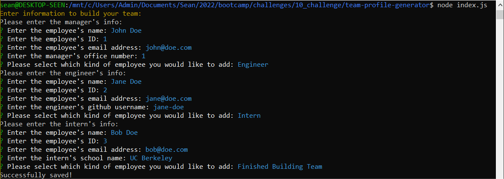

# Team Profile Generator

A command-line application that takes in information about employees on a software engineering team and generates an HTML webpage that displays summaries for each person.

## Description

This Node.js application uses the inquirer package to prompt the user with a series of questions about their employees, then generates an HTML page with information on a engineering team, styled using Bootstrap and Font Awesome icons. The jest package was used in development to validate the functionality of classes.

## Technologies Used

- [Node.js](https://nodejs.org/)
- [Inquirer](https://www.npmjs.com/package/inquirer)
- [email-validator](https://www.npmjs.com/package/email-validator)
- [Bootstrap 4.6.2](https://getbootstrap.com/docs/4.6)
- [Font Awesome](https://fontawesome.com/)

## Table of Contents

- [Installation](#installation)
- [Usage](#usage)
- [Credits](#credits)
- [License](#license)
- [Contributing](#contributing)
- [Tests](#tests)
- [Questions](#questions)

## Installation

Upload all files or fork this repository to a Node.js runtime environment. Run `npm -i` from the root directory to install dependencies for this app.

## Usage

From the root directory, run `node index.js` to start the application. Follow the series of questions to fill in information about your team. Once you are finished, the application will generate an index.html file in the `./dist` directory.




[Walkthrough Video](https://drive.google.com/file/d/1KVl4kfjS2zJzK7CS9IFRF14Co7VUx9Af/view?usp=sharing)

## Credits
This application was built with the support of the resources and staff of the UCB Full Stack Full Time Coding Bootcamp Summer 2022. 

### References

- https://en.m.wikipedia.org/wiki/ANSI_escape_code#Colors

## License

<details>
  <summary><b>MIT License</b></summary>

```
MIT License

Copyright (c) 2022 seannoh

Permission is hereby granted, free of charge, to any person obtaining a copy
of this software and associated documentation files (the "Software"), to deal
in the Software without restriction, including without limitation the rights
to use, copy, modify, merge, publish, distribute, sublicense, and/or sell
copies of the Software, and to permit persons to whom the Software is
furnished to do so, subject to the following conditions:

The above copyright notice and this permission notice shall be included in all
copies or substantial portions of the Software.

THE SOFTWARE IS PROVIDED "AS IS", WITHOUT WARRANTY OF ANY KIND, EXPRESS OR
IMPLIED, INCLUDING BUT NOT LIMITED TO THE WARRANTIES OF MERCHANTABILITY,
FITNESS FOR A PARTICULAR PURPOSE AND NONINFRINGEMENT. IN NO EVENT SHALL THE
AUTHORS OR COPYRIGHT HOLDERS BE LIABLE FOR ANY CLAIM, DAMAGES OR OTHER
LIABILITY, WHETHER IN AN ACTION OF CONTRACT, TORT OR OTHERWISE, ARISING FROM,
OUT OF OR IN CONNECTION WITH THE SOFTWARE OR THE USE OR OTHER DEALINGS IN THE
SOFTWARE.
```
      
</details>

## Contributing
This project isn't currently acccepting contributions.

## Tests

Run `npm test` to run tests via the jest package

## Questions

- View my Github [profile](https://github.com/seannoh)
- Contact me at my [email](https://github.com/seannoh@ucsb.edu)
